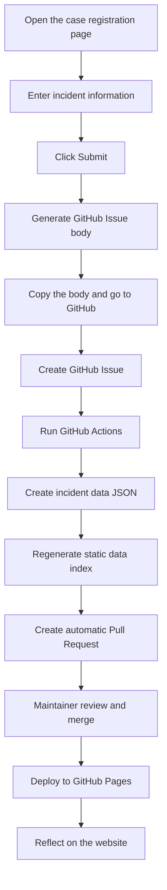

# Security Log

[](https://github.com/dev-five-git/security-log/actions/workflows/case-submission.yml)
[](https://github.com/dev-five-git/security-log/actions/workflows/deploy.yml)

**Security Log** is an open-source archive for publicly known cybersecurity incidents and personal data breach cases.

Anyone can submit an incident through the website's case registration page. The submitted content is converted into a GitHub Issue, processed by GitHub Actions, and turned into a data Pull Request. Once the Pull Request is reviewed and merged by a maintainer, the case is reflected on the website.

- Website: https://security-log.devfive.kr
- Submit a case: https://security-log.devfive.kr/register/
- Repository: https://github.com/dev-five-git/security-log

---

## Project Purpose

Security incidents repeat.

Phishing, account takeover, insider leaks, weak access control, misconfiguration, insufficient encryption, and failure to detect large-scale data exfiltration appear again and again across different incidents. Security Log records these cases in public so that individuals, developers, security practitioners, and organizations can learn from past failures.

This project aims to:

- Record real cybersecurity incidents and personal data breaches as structured data.
- Make incident causes, leaked data types, damage scale, timelines, and prevention lessons easy to review.
- Provide a website-based case submission flow and a GitHub Issue-based public review process.
- Automatically generate data Pull Requests using GitHub Actions.
- Build a practical knowledge base for security awareness training, privacy education, and incident response exercises.
- Preserve repeated security failure patterns as learnable records instead of blaming specific companies or individuals.

---

## How the Service Works

Security Log is an open-source record service that combines a static website with a GitHub-based collaboration workflow.



### Automation Summary

1. A user enters incident information on the website's case registration page.
2. When the user clicks `Submit`, the website generates the body for a GitHub Issue.
3. The user copies the generated body and moves to the GitHub Issue creation page.
4. The Issue includes the `case-submission` label.
5. When an Issue with the `case-submission` label is opened, GitHub Actions runs automatically.
6. The workflow parses the JSON data in the Issue body and creates an `apps/front/data/{uuid}.json` file.
7. The workflow regenerates `apps/front/src/static/accidents-data.generated.ts`.
8. Type checking and linting are executed.
9. A `case/{issue-number}` branch is created and an automatic Pull Request is opened.
10. The original Issue is closed automatically, and a comment with the generated PR link is added.
11. When the PR is merged into the `main` branch, the GitHub Pages deployment workflow runs.
12. After the build and deployment finish, the new case appears on the website.

---

## How to Submit a Case

The recommended way to contribute incident data is to use the website's **case registration page**.

### 1. Open the Case Registration Page

Go to:

```txt
https://security-log.devfive.kr/register/
```

### 2. Enter Incident Information

Fill in the following fields on the registration page.

| Field | Description |
|---|---|
| Company name | The company, organization, or service involved in the incident |
| Incident date | The date the incident occurred or was officially disclosed |
| Country | The country where the incident occurred or whose users were affected |
| Damage scale | Publicly verifiable damage scale |
| Incident cause | One of hacking, insider, negligence, technical defect, or unknown |
| Tags | Keywords for search and classification, separated by commas |
| Leaked data | Personal information or data types that were leaked |
| Timeline | Key events from detection to response or disclosure |
| Cause analysis | Root causes, weaknesses, or failure points behind the incident |
| Prevention lessons - Personal | Actions individual users can take to reduce risk |
| Prevention lessons - Corporate | Actions companies or organizations can take to reduce risk |

### 3. Create a GitHub Issue

After filling out the form, click `Submit`. The website will generate the body for a GitHub Issue.

1. Copy the Issue body shown in the modal.
2. Click `Go to GitHub` to open the Issue creation page.
3. Paste the copied body into the GitHub Issue body field.
4. Review the content and create the Issue.

Once the Issue is created, the automation workflow starts and creates a data Pull Request.

### 4. Review and Publication

Submitted cases are not reflected on the website immediately.

A maintainer must review and merge the generated Pull Request before the case is published. During review, maintainers may request corrections, source improvements, wording changes, or additional context.

---

## What Makes a Good Submission

A good case submission should follow these principles:

- Submit only incidents that can be publicly verified.
- Use reliable sources such as news articles, company notices, government announcements, investigation reports, privacy authority publications, or KISA materials.
- Select `unknown` when the cause has not been officially confirmed.
- Do not include speculation, excessive blame, or unverified internal information.
- Never include raw leaked personal information, leaked data samples, account credentials, authentication information, tokens, sessions, or cookies.
- Do not include malware, exploit code, attack procedures, or reproduction steps for intrusion.
- Focus on which security controls failed rather than blaming a specific company or person.

---

## Incident Cause Categories

The currently supported cause categories are:

| Value | Display name | Description |
|---|---|---|
| `hacking` | Hacking | External attacks, account takeover, intrusion, malware, phishing, and similar causes |
| `insider` | Insider | Leaks caused by employees, contractors, partners, or other privileged insiders |
| `negligence` | Negligence | Misconfiguration, weak access control, insufficient encryption, operational mistakes, and similar issues |
| `technical` | Technical defect | System vulnerabilities, design flaws, software defects, and similar technical failures |
| `unknown` | Unknown | The cause has not been officially confirmed or remains unclear |

---

## Data Structure

The website's case registration page converts user input into JSON data inside a GitHub Issue body.

The Issue automation parses that JSON and creates an `apps/front/data/{uuid}.json` file.

### Example JSON Included in an Issue

```json
{
  "companyName": "Company name",
  "date": "2026-01-01",
  "country": "KR",
  "cause": "hacking",
  "damage": {
    "value": 0,
    "unit": "만"
  },
  "tags": ["tag1", "tag2"],
  "leaks": ["Example leaked data item"],
  "causeAnalyses": [
    {
      "date": "2026-01-01",
      "content": "Incident development or cause analysis details"
    }
  ],
  "rootCauses": ["Example root cause"],
  "prevention": {
    "personal": ["Personal prevention measure"],
    "corporate": ["Corporate prevention measure"]
  }
}
```

### Stored Incident Data Type

Internally, incident data may contain both Korean and English fields for multilingual display.

```ts
interface Accident {
  id: string
  companyName: {
    ko: string
    en: string
  }
  date: string
  country: string
  cause: 'hacking' | 'insider' | 'negligence' | 'technical' | 'unknown'
  damage: {
    value: number
    unit: '억' | '만' | '천' | ''
  }
  leaks: {
    ko: string[]
    en: string[]
  }
  causeAnalyses: {
    date: string
    content: {
      ko: string
      en: string
    }
  }[]
  rootCauses: {
    ko: string[]
    en: string[]
  }
  prevention: {
    personal: {
      ko: string[]
      en: string[]
    }
    corporate: {
      ko: string[]
      en: string[]
    }
  }
  tags: {
    ko: string[]
    en: string[]
  }
  createdAt: string
  issueUrl?: string
}
```

---

## Add Data Through a Pull Request

You can also add incident data directly through a Pull Request instead of using the website submission flow.

### 1. Add a Data File

Create a new JSON file under `apps/front/data/`. A UUID-style filename is recommended.

```txt
apps/front/data/xxxxxxxx-xxxx-xxxx-xxxx-xxxxxxxxxxxx.json
```

### 2. Regenerate the Static Index

If you add or modify a data file, regenerate the static index:

```sh
node .github/scripts/generate-index.mjs
```

This command reads `apps/front/data/*.json` files and regenerates `apps/front/src/static/accidents-data.generated.ts`.

### 3. Validate Changes

```sh
bun install
bunx tsc --noEmit -p apps/front/tsconfig.json
bun lint
bun run build
```

---

## Local Development

### Requirements

- Bun
- Node.js 22 or later recommended
- Git

### Installation

```sh
git clone https://github.com/dev-five-git/security-log.git
cd security-log
bun install
```

### Run the Development Server

```sh
bun run dev
```

Open the following URL in your browser:

```txt
http://localhost:3000
```

### Build

```sh
bun run build
```

### Test

```sh
bun test
```

### Lint

```sh
bun lint
```

### Auto-fix Lint Issues

```sh
bun lint:fix
```

---

## Tech Stack

- TypeScript
- Next.js
- React
- Bun
- GitHub Actions
- GitHub Pages
- oxlint
- Devup UI

---

## Repository Structure

```txt
.
├── .github
│   ├── ISSUE_TEMPLATE
│   │   └── case-submission.md
│   ├── scripts
│   │   ├── generate-index.mjs
│   │   └── process-case-issue.mjs
│   └── workflows
│       ├── case-submission.yml
│       └── deploy.yml
├── apps
│   └── front
│       ├── data
│       │   └── *.json
│       └── src
│           ├── app
│           │   └── register
│           ├── components
│           │   └── pages
│           │       └── register
│           ├── lib
│           │   └── issue-template.ts
│           └── static
│               ├── accidents.ts
│               └── accidents-data.generated.ts
├── Dockerfile.front
├── docker-compose.yml
├── package.json
└── README.md
```

### Key Files

| Path | Description |
|---|---|
| `apps/front/src/app/register/` | Website case registration page |
| `apps/front/src/components/pages/register/` | Case registration form, modal, and input components |
| `apps/front/src/lib/issue-template.ts` | Logic that converts form data into a GitHub Issue title and body |
| `.github/ISSUE_TEMPLATE/case-submission.md` | Case submission template for users who create an Issue directly on GitHub |
| `.github/workflows/case-submission.yml` | Workflow that converts a `case-submission` Issue into a data Pull Request |
| `.github/workflows/deploy.yml` | Workflow that deploys the site to GitHub Pages after changes are merged into `main` |
| `.github/scripts/process-case-issue.mjs` | Script that parses JSON from the Issue body and creates an incident data file |
| `.github/scripts/generate-index.mjs` | Script that generates the static data index from `apps/front/data/*.json` |
| `apps/front/data/` | Incident case JSON data directory |
| `apps/front/src/static/accidents.ts` | Incident data types, formatting, search, and filtering logic |
| `apps/front/src/static/accidents-data.generated.ts` | Auto-generated incident data index |

---

## Deployment

This project is deployed to GitHub Pages through GitHub Actions.

The deployment workflow runs on:

- Pushes to the `main` branch
- Pull Requests targeting the `main` branch
- Manual workflow dispatch

For Pull Requests, the workflow performs build validation. Actual deployment runs only when changes are pushed to the `main` branch.

---

## Run With Docker Compose

The repository includes a Docker Compose setup.

```sh
docker compose up -d
```

The default port is `80`. You can change it with the `PORT` environment variable.

```sh
PORT=8080 docker compose up -d
```

---

## Contribution Guide

Security Log is a public record project. You can contribute in many ways:

- Submit new cybersecurity incident cases.
- Fix typos or incorrect data in existing cases.
- Improve incident causes, prevention lessons, or timelines.
- Improve multilingual translations.
- Improve UI/UX.
- Improve search, filtering, or statistics features.
- Add tests.
- Improve documentation.

### Checklist Before Opening a Pull Request

Before submitting a PR, run:

```sh
bun install
bun test
bun lint
bun run build
```

If you directly modified data files, also run:

```sh
node .github/scripts/generate-index.mjs
```

---

## Data Writing Principles

Security Log data is public information intended for education and historical record.

### Information You May Include

- Public incident summary
- Incident date or disclosure date
- Damage scale
- Leaked data types
- Publicly known incident cause
- Incident timeline
- Root causes
- Prevention lessons for individuals and organizations
- Tags based on public sources

### Information You Must Not Include

- Raw leaked personal information
- Accounts, passwords, tokens, sessions, cookies, or other authentication information
- Non-public internal documents
- Attack tool usage instructions
- Vulnerability exploitation procedures
- Malware code or execution instructions
- Unverified claims
- Defamatory statements
- Sensitive information that can identify a private individual

---

## Security and Reporting Notice

This repository is a public archive for cybersecurity incident records. It is not an official channel for vulnerability reports, incident reports, or personal data breach reports.

If you discover an actual security incident, personal data breach, or illegal content, report it to the relevant authority or the affected service operator.

For security issues related to this service itself or repository operations, do not post sensitive information in a public Issue. Contact the maintainers separately.

---

## FAQ

### Will a submitted case appear on the website immediately?

No. Cases submitted through the website are converted into a GitHub Issue and then into a Pull Request. A maintainer must review and merge the PR before the case appears on the website.

### Why do I need to copy the GitHub Issue body?

The registration page converts your input into a GitHub Issue body. Copying and pasting that generated body into GitHub allows the automation workflow to parse the data correctly.

### Why is the Issue closed automatically?

After a data Pull Request is created, the original Issue is closed automatically and a comment with the generated PR link is added. Review and corrections continue in the Pull Request.

### What should I do if I do not know the incident cause?

Select `unknown` if the cause has not been officially confirmed. Avoid guessing between `hacking`, `insider`, `negligence`, or `technical`.

### What should I do if the damage scale is unclear?

Use numbers from official announcements or reliable public sources whenever possible. If the scale is unclear, write conservatively and leave enough context for maintainers to improve it during review.

### Can I create an Issue directly on GitHub?

Yes. However, using the website's case registration page is recommended because the generated Issue body includes the JSON block required for automated processing.

### Can I add a data file directly through a Pull Request?

Yes. Add or modify `apps/front/data/*.json`, then run `node .github/scripts/generate-index.mjs` to update the static index together with the data change.
