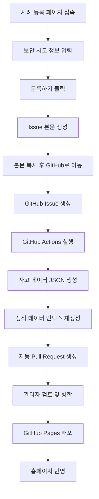

# 보안록 Security Log

[](https://github.com/dev-five-git/security-log/actions/workflows/case-submission.yml)
[](https://github.com/dev-five-git/security-log/actions/workflows/deploy.yml)

**보안록**은 공개적으로 알려진 보안 사고와 개인정보 유출 사례를 함께 기록하는 오픈소스 아카이브입니다.

누구나 홈페이지의 사례 등록 페이지에서 사고 사례를 입력하고, 생성된 GitHub Issue를 통해 데이터 추가에 참여할 수 있습니다. 등록된 Issue는 GitHub Actions에 의해 데이터 Pull Request로 변환되고, 관리자가 검토 후 병합하면 홈페이지에 반영됩니다.

- 서비스: https://security-log.devfive.kr
- 사례 등록: https://security-log.devfive.kr/register/
- 저장소: https://github.com/dev-five-git/security-log

---

## 프로젝트 목적

보안 사고는 반복됩니다.

피싱, 계정 탈취, 내부자 유출, 접근 통제 미흡, 설정 오류, 암호화 미흡, 대량 데이터 반출 탐지 실패처럼 이미 알려진 원인이 여러 사고에서 되풀이됩니다. 보안록은 이런 사례를 공개적으로 기록하여 개인, 개발자, 보안 담당자, 기업이 과거 사고로부터 배울 수 있도록 돕습니다.

이 프로젝트는 다음을 목표로 합니다.

- 실제 보안 사고와 개인정보 유출 사례를 구조화된 데이터로 기록
- 사고 원인, 유출 항목, 피해 규모, 타임라인, 예방책을 한눈에 확인
- 홈페이지 기반 사례 등록과 GitHub Issue 기반 공개 검토 흐름 제공
- GitHub Actions를 이용한 자동 데이터 PR 생성
- 보안 교육, 개인정보보호 교육, 사고 대응 훈련에 활용 가능한 자료 축적
- 특정 기업을 비난하기보다 반복되는 보안 실패 패턴을 학습 가능한 기록으로 보존

---

## 서비스 흐름

보안록은 정적 웹사이트와 GitHub 협업 흐름을 결합한 오픈소스 기록 서비스입니다.



### 자동화 요약

1. 사용자가 홈페이지의 사례 등록 페이지에서 사고 정보를 입력합니다.
2. `등록하기` 버튼을 누르면 GitHub Issue 본문이 생성됩니다.
3. 사용자는 생성된 본문을 복사한 뒤 GitHub Issue 생성 화면으로 이동합니다.
4. Issue에는 `case-submission` 라벨이 포함됩니다.
5. `case-submission` 라벨이 있는 Issue가 열리면 GitHub Actions가 실행됩니다.
6. 이슈 본문 안의 JSON 데이터를 파싱해 `apps/front/data/{uuid}.json` 파일을 생성합니다.
7. `apps/front/src/static/accidents-data.generated.ts` 파일을 재생성합니다.
8. 타입 체크와 린트를 실행합니다.
9. `case/{issue-number}` 브랜치가 생성되고 자동 Pull Request가 만들어집니다.
10. 원본 Issue는 자동으로 닫히며, 생성된 PR 링크가 댓글로 남습니다.
11. PR이 `main` 브랜치에 병합되면 GitHub Pages 배포 워크플로가 실행됩니다.
12. 빌드와 배포가 완료되면 홈페이지에 새 사례가 반영됩니다.

---

## 사례 등록 방법

가장 권장되는 기여 방식은 홈페이지의 **사례 등록하기** 페이지를 이용하는 것입니다.

### 1. 사례 등록 페이지 접속

아래 페이지로 이동합니다.

```txt
https://security-log.devfive.kr/register/
```

### 2. 사고 정보 입력

등록 페이지에서 다음 정보를 입력합니다.

| 항목 | 설명 |
|---|---|
| 회사명 | 사고가 발생한 기업, 기관, 서비스명 |
| 사고 날짜 | 사고 발생일 또는 공식 발표일 |
| 국가 | 사고가 발생했거나 대상이 된 국가 |
| 피해 규모 | 공개적으로 확인 가능한 피해 규모 |
| 사고 원인 | 해킹, 내부자, 관리부실, 기술결함, 미상 중 선택 |
| 태그 | 검색과 분류에 사용할 키워드. 쉼표로 구분 |
| 유출 내역 | 유출된 개인정보 또는 데이터 항목 |
| 타임라인 | 사고 인지부터 종료까지의 진행 과정 |
| 원인 분석 | 사고의 근본 원인 또는 취약점 |
| 예방 교훈 - 개인 | 개인 사용자가 취할 수 있는 예방 수칙 |
| 예방 교훈 - 기업 | 기업/기관이 취할 수 있는 예방 수칙 |

### 3. GitHub Issue 생성

폼을 작성한 뒤 `등록하기`를 누르면 GitHub Issue에 넣을 본문이 생성됩니다.

1. 모달에 표시된 Issue 본문을 복사합니다.
2. `GitHub로 이동` 버튼을 눌러 Issue 생성 화면으로 이동합니다.
3. GitHub Issue 본문에 복사한 내용을 붙여넣습니다.
4. 내용을 확인한 뒤 Issue를 생성합니다.

Issue가 생성되면 자동화가 실행되고, 데이터 추가 Pull Request가 만들어집니다.

### 4. 검토 및 반영

홈페이지에 바로 반영되지는 않습니다.

생성된 Pull Request를 관리자가 검토하고 병합해야 홈페이지에 반영됩니다. 검토 과정에서 내용 수정, 출처 보강, 표현 조정이 요청될 수 있습니다.

---

## 좋은 제보 기준

좋은 제보는 다음 조건을 만족합니다.

- 공개적으로 확인 가능한 사고만 등록합니다.
- 기사, 기업 공지, 정부 발표, 수사기관 발표, 개인정보보호위원회, KISA 자료 등 신뢰 가능한 출처를 기반으로 작성합니다.
- 사고 원인을 단정하기 어려운 경우 `미상`을 선택합니다.
- 추측성 표현, 과도한 비난, 확인되지 않은 내부 정보는 포함하지 않습니다.
- 개인정보 원문, 유출 데이터 샘플, 계정 정보, 인증 정보, 토큰, 세션, 쿠키는 절대 포함하지 않습니다.
- 악성코드, 공격 코드, 취약점 악용 절차, 침해 재현 방법은 포함하지 않습니다.
- 특정 기업이나 개인을 비난하기보다 “어떤 보안 통제가 실패했는가”에 집중합니다.

---

## 사고 원인 분류

현재 지원하는 사고 원인 분류는 다음과 같습니다.

| 값 | 표시명 | 설명 |
|---|---|---|
| `hacking` | 해킹 | 외부 공격, 계정 탈취, 침입, 악성코드, 피싱 등 |
| `insider` | 내부자 | 임직원, 협력사, 권한 보유자에 의한 유출 |
| `negligence` | 관리부실 | 설정 오류, 접근 통제 미흡, 암호화 미흡, 운영 실수 등 |
| `technical` | 기술결함 | 시스템 취약점, 설계 결함, 소프트웨어 오류 등 |
| `unknown` | 미상 | 원인이 공식적으로 확인되지 않았거나 불명확한 경우 |

---

## 데이터 구조

홈페이지의 사례 등록 페이지는 사용자가 입력한 값을 GitHub Issue 본문 안의 JSON 데이터로 변환합니다.

Issue 자동화는 해당 JSON을 파싱해 `apps/front/data/{uuid}.json` 파일을 생성합니다.

### Issue에 포함되는 기본 JSON 예시

```json
{
  "companyName": "회사명",
  "date": "2026-01-01",
  "country": "KR",
  "cause": "hacking",
  "damage": {
    "value": 0,
    "unit": "만"
  },
  "tags": ["태그1", "태그2"],
  "leaks": ["유출 항목 예시"],
  "causeAnalyses": [
    {
      "date": "2026-01-01",
      "content": "사고 전개 또는 원인 분석 내용"
    }
  ],
  "rootCauses": ["근본 원인 예시"],
  "prevention": {
    "personal": ["개인 예방 수칙"],
    "corporate": ["기업 예방 수칙"]
  }
}
```

### 저장되는 사고 데이터 타입

저장소 내부 데이터는 다국어 표시를 위해 한국어/영어 필드를 함께 가질 수 있습니다.

```ts
interface Accident {
  id: string
  companyName: {
    ko: string
    en: string
  }
  date: string
  country: string
  cause: 'hacking' | 'insider' | 'negligence' | 'technical' | 'unknown'
  damage: {
    value: number
    unit: '억' | '만' | '천' | ''
  }
  leaks: {
    ko: string[]
    en: string[]
  }
  causeAnalyses: {
    date: string
    content: {
      ko: string
      en: string
    }
  }[]
  rootCauses: {
    ko: string[]
    en: string[]
  }
  prevention: {
    personal: {
      ko: string[]
      en: string[]
    }
    corporate: {
      ko: string[]
      en: string[]
    }
  }
  tags: {
    ko: string[]
    en: string[]
  }
  createdAt: string
  issueUrl?: string
}
```

---

## 직접 Pull Request로 데이터 추가하기

홈페이지 등록 흐름 대신 직접 Pull Request를 만들 수도 있습니다.

### 1. 데이터 파일 추가

`apps/front/data/` 아래에 새 JSON 파일을 추가합니다. 파일명은 UUID 형식을 권장합니다.

```txt
apps/front/data/xxxxxxxx-xxxx-xxxx-xxxx-xxxxxxxxxxxx.json
```

### 2. 정적 인덱스 재생성

데이터 파일을 추가하거나 수정했다면 다음 명령어로 정적 인덱스를 갱신합니다.

```sh
node .github/scripts/generate-index.mjs
```

이 명령은 `apps/front/data/*.json` 파일을 읽어 `apps/front/src/static/accidents-data.generated.ts` 파일을 재생성합니다.

### 3. 검증

```sh
bun install
bunx tsc --noEmit -p apps/front/tsconfig.json
bun lint
bun run build
```

---

## 로컬 개발

### 요구사항

- Bun
- Node.js 22 이상 권장
- Git

### 설치

```sh
git clone https://github.com/dev-five-git/security-log.git
cd security-log
bun install
```

### 개발 서버 실행

```sh
bun run dev
```

브라우저에서 다음 주소를 엽니다.

```txt
http://localhost:3000
```

### 빌드

```sh
bun run build
```

### 테스트

```sh
bun test
```

### 린트

```sh
bun lint
```

### 린트 자동 수정

```sh
bun lint:fix
```

---

## 기술 스택

- TypeScript
- Next.js
- React
- Bun
- GitHub Actions
- GitHub Pages
- oxlint
- Devup UI

---

## 저장소 구조

```txt
.
├── .github
│   ├── ISSUE_TEMPLATE
│   │   └── case-submission.md
│   ├── scripts
│   │   ├── generate-index.mjs
│   │   └── process-case-issue.mjs
│   └── workflows
│       ├── case-submission.yml
│       └── deploy.yml
├── apps
│   └── front
│       ├── data
│       │   └── *.json
│       └── src
│           ├── app
│           │   └── register
│           ├── components
│           │   └── pages
│           │       └── register
│           ├── lib
│           │   └── issue-template.ts
│           └── static
│               ├── accidents.ts
│               └── accidents-data.generated.ts
├── Dockerfile.front
├── docker-compose.yml
├── package.json
└── README.md
```

### 주요 파일 설명

| 경로 | 설명 |
|---|---|
| `apps/front/src/app/register/` | 홈페이지 사례 등록 페이지 |
| `apps/front/src/components/pages/register/` | 사례 등록 폼, 모달, 입력 컴포넌트 |
| `apps/front/src/lib/issue-template.ts` | 등록 폼 데이터를 GitHub Issue 제목/본문으로 변환하는 로직 |
| `.github/ISSUE_TEMPLATE/case-submission.md` | GitHub에서 직접 Issue를 만들 때 사용할 수 있는 사례 제보 템플릿 |
| `.github/workflows/case-submission.yml` | `case-submission` Issue를 데이터 PR로 변환하는 자동화 워크플로 |
| `.github/workflows/deploy.yml` | `main` 브랜치 병합 후 GitHub Pages로 배포하는 워크플로 |
| `.github/scripts/process-case-issue.mjs` | Issue 본문의 JSON을 파싱해 사고 데이터 파일을 생성하는 스크립트 |
| `.github/scripts/generate-index.mjs` | `apps/front/data/*.json`을 기반으로 정적 데이터 인덱스를 생성하는 스크립트 |
| `apps/front/data/` | 사고 사례 JSON 데이터 저장소 |
| `apps/front/src/static/accidents.ts` | 사고 데이터 타입, 포맷팅, 검색/필터링 로직 |
| `apps/front/src/static/accidents-data.generated.ts` | 자동 생성되는 사고 데이터 인덱스 |

---

## 배포

이 프로젝트는 GitHub Actions를 통해 GitHub Pages로 배포됩니다.

배포 워크플로는 다음 이벤트에서 실행됩니다.

- `main` 브랜치에 push
- `main` 브랜치 대상 Pull Request
- 수동 실행

Pull Request에서는 빌드 검증이 수행되고, 실제 배포는 `main` 브랜치에 push된 경우에만 실행됩니다.

---

## Docker Compose 실행

저장소에는 Docker Compose 기반 실행 구성도 포함되어 있습니다.

```sh
docker compose up -d
```

기본 포트는 `80`이며, `PORT` 환경변수로 변경할 수 있습니다.

```sh
PORT=8080 docker compose up -d
```

---

## 기여 가이드

보안록은 공개 기록 프로젝트입니다. 누구나 다음 방식으로 기여할 수 있습니다.

- 새로운 보안 사고 사례 제보
- 기존 사고 데이터의 오탈자 수정
- 사고 원인, 예방책, 타임라인 보강
- 다국어 번역 보완
- UI/UX 개선
- 검색, 필터링, 통계 기능 개선
- 테스트 코드 추가
- 문서 개선

### Pull Request 작성 시 확인사항

PR을 보내기 전에 다음을 확인해 주세요.

```sh
bun install
bun test
bun lint
bun run build
```

데이터 파일을 직접 수정했다면 반드시 다음 명령어도 실행해 주세요.

```sh
node .github/scripts/generate-index.mjs
```

---

## 데이터 작성 원칙

보안록의 데이터는 교육과 기록을 위한 공개 정보입니다.

### 포함할 수 있는 정보

- 공개된 사고 개요
- 사고 발생일 또는 발표일
- 피해 규모
- 유출 항목
- 공개적으로 알려진 사고 원인
- 사고 타임라인
- 근본 원인
- 개인/기업 관점의 예방책
- 공개 출처 기반의 태그

### 포함하면 안 되는 정보

- 유출된 개인정보 원문
- 계정, 비밀번호, 토큰, 세션, 쿠키 등 인증 정보
- 비공개 내부 문서
- 공격 도구 사용법
- 취약점 악용 절차
- 악성코드 코드 또는 실행 방법
- 확인되지 않은 주장
- 명예훼손 가능성이 있는 표현
- 특정 개인을 식별할 수 있는 민감 정보

---

## 보안 및 신고 안내

이 저장소는 보안 사고를 기록하는 공개 아카이브입니다. 새로운 취약점 제보, 침해 사고 신고, 개인정보 유출 신고를 처리하는 공식 창구가 아닙니다.

실제 침해 사고, 개인정보 유출, 불법 정보 발견 시에는 관련 기관 또는 해당 서비스 운영사에 신고해 주세요.

서비스 자체의 보안 문제나 저장소 운영 관련 문의는 공개 Issue에 민감 정보를 올리지 말고 운영자에게 별도로 문의해 주세요.

---

## FAQ

### 홈페이지에서 사례를 등록하면 바로 반영되나요?

아닙니다. 홈페이지에서 등록한 내용은 GitHub Issue와 Pull Request로 이어집니다. 관리자가 PR을 검토하고 병합해야 홈페이지에 반영됩니다.

### 왜 GitHub Issue 본문을 복사해야 하나요?

등록 페이지는 사용자가 입력한 내용을 GitHub Issue 본문으로 변환합니다. 생성된 본문을 복사한 뒤 GitHub Issue 생성 화면에 붙여넣으면 자동화가 해당 데이터를 파싱할 수 있습니다.

### Issue가 자동으로 닫히는 이유는 무엇인가요?

사례 데이터 PR이 생성되면 원본 Issue는 자동으로 닫히고, 생성된 PR 링크가 댓글로 남습니다. 이후 검토와 수정은 PR에서 진행됩니다.

### 사고 원인을 모르면 어떻게 하나요?

공식적으로 확인되지 않은 경우 `미상`을 선택해 주세요. 추측으로 `해킹`, `내부자`, `관리부실`, `기술결함`을 선택하지 않는 것이 좋습니다.

### 피해 규모가 정확하지 않으면 어떻게 하나요?

공식 발표 또는 신뢰 가능한 공개 출처의 수치를 사용해 주세요. 피해 규모가 불명확하면 가능한 범위에서 보수적으로 작성하거나 검토 과정에서 보완할 수 있도록 설명을 남겨 주세요.

### GitHub에서 직접 Issue를 만들어도 되나요?

가능합니다. 다만 홈페이지의 사례 등록 페이지를 이용하는 것을 권장합니다. 홈페이지에서 생성된 Issue 본문에는 자동 처리에 필요한 JSON 블록이 포함됩니다.

### 직접 PR로 데이터 파일을 추가해도 되나요?

가능합니다. `apps/front/data/*.json` 파일을 추가한 뒤 `node .github/scripts/generate-index.mjs`를 실행해 정적 인덱스를 함께 갱신해 주세요.
